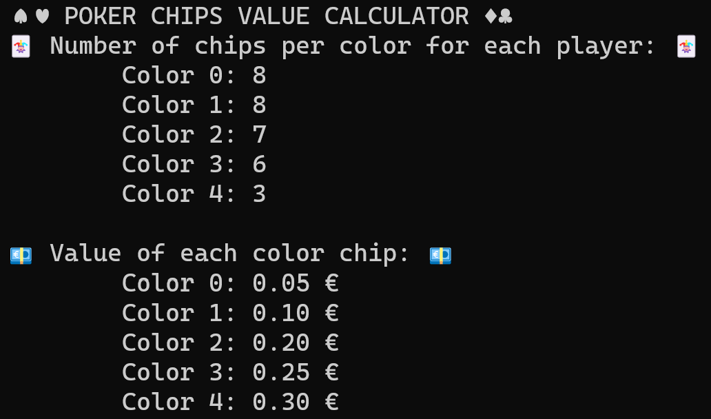

# :spades::hearts: Poker chips value calculator:diamonds::clubs:

If during the current Christmas holidays or during your quarantine (given the bad situation caused by Covid-19 that we are going through) you are spending your nights playing poker with your family/flatmates like me, this repository is what you are looking for.

***Poker chips value calculator*** is a script that using the CP paradigm, solve a *Constraint Satisfaction Problem* where the objective is to compute:

- the **number of chips** to give to each player on the table, taking in consideration the total number of chips that you have
- the **real value** in euro to assign to **each color of chip** taking in consideration the initial budget that each player use to sit on the table

You can customize every parameter of your poker game (like the number of players, the total number of chips that you have for each color, the initial budget, etc) simply changing the values in the file  `data.dzn` and then execute the script `poker_chips_value_calculator.py` to enjoy your game! :black_joker:


## Cloning

First of all, you need to download the repository through cloning.

```sh
git clone https://github.com/gmurro/pokerChipsValueCalculator.git
cd pokerChipsValueCalculator
```

## **1. Prerequisites**

MiniZinc Python provides a native python interface for the MiniZinc toolchain and it is the only thing that you need. If you have the `pip` package manager installed, then the simplest way of installing MiniZinc Python is using the following command: 

    $ pip install minizinc

## **2. Customization**
The file `data.dzn` contains all the parameters used by the script that you can customize. In particular:

- *n_players* - Number of players playing poker
- *n_color_chips* - Number of colors of the poker chips contained in your poker set
- *n_chips* - Array of number of poker chips for each color from the lower value to the higher  (e.g. white, blue, red, black, green)
- *budget* -  Initial budget for each player to start the poker (euro)
- *unit* - Magnitude of the precision according to compute the values (eg. 1 for non-decimal values, 10 for tens of cents, 100 for cents)
- *min_tot_chips* - Minimum number of total poker chips that each player should have
- *min_n_chips* -  Array of minimum number of poker chips for each color that each player should have  from the lower value to the higher (e.g. white, blue, red, black, green)
- *max_n_chips* -  Array of maximum number of poker chips for each color that each player should have  from the lower value to the higher (e.g. white, blue, red, black, green)

## **3. Run**

You can run the python script with the following command:

```console
python poker_chips_value_calculator.py
```

Otherwise if you have the MiniZinc toolchain installed, you can execute directly the project `poker_chips_value.mzp` using the Gecode solver.

## **4. Output format**

An example of the output format is the following:




## License

This project is licensed under the MIT License - see the [LICENSE](LICENSE) file for details
